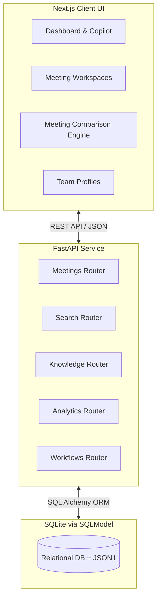

# FireNotes AI 🚀

An Enterprise Organizational Memory Platform that transforms fragmented meeting conversations into a searchable, relational, and intelligent company-wide Knowledge Graph.

Built with **Next.js (App Router)**, **Tailwind CSS v4**, **Framer Motion**, **FastAPI**, and **SQLite**.

---

## 📖 Project Overview

Modern enterprises lose thousands of hours a year trying to track down decisions, tasks, and context from past meetings. FireNotes AI is a proactive Organizational Memory platform that:

1. **Ingests** meeting transcripts (text, audio, or real-time simulation).
2. **Analyzes** conversations using AI to extract Tasks, Decisions, Risks, and Global Knowledge Entities.
3. **Connects** these entities into a Cross-Meeting Knowledge Graph.
4. **Empowers** teams with proactive recommendations, automated workflows (Slack/Email/Jira exports), and detailed analytics.

## 🏗️ Architecture



## ✨ The 25-Feature Matrix

| Area | Feature | Status |
| :--- | :--- | :---: |
| **Core** | Multi-tenant Meeting Workspaces | ✅ |
| **Core** | Real-time Transcript Processing | ✅ |
| **Core** | Multi-speaker diarization UI | ✅ |
| **Core** | AI Summary Generation | ✅ |
| **Core** | Sentiment Analysis (Positive, Neutral, Negative) | ✅ |
| **Intelligence** | Automated Action Item Extraction | ✅ |
| **Intelligence** | Risk & Blocker Flagging | ✅ |
| **Intelligence** | Thematic Topic Tagging | ✅ |
| **Intelligence** | Health Score Calculation | ✅ |
| **Intelligence** | Decision Log Extraction | ✅ |
| **Knowledge Graph**| Global Knowledge Entity Normalization | ✅ |
| **Knowledge Graph**| Cross-Meeting Entity Timeline | ✅ |
| **Knowledge Graph**| Omni-Search Bar (Fuzzy matching) | ✅ |
| **Knowledge Graph**| Entity "Mentioned In" Linking | ✅ |
| **Knowledge Graph**| Decision Lifecycle Tracking | ✅ |
| **Analytics** | Individual Team Member Profiles | ✅ |
| **Analytics** | Global Tasks Completed Percentage | ✅ |
| **Analytics** | Average Talk Time Metrics | ✅ |
| **Analytics** | Open Decisions Tracking | ✅ |
| **Analytics** | Meeting Comparison Engine (Mathematical Deltas) | ✅ |
| **Proactive AI** | AI Workflow Generator (Slack, Email, Jira exports) | ✅ |
| **Proactive AI** | Floating Proactive Alerts Toast | ✅ |
| **Proactive AI** | Smart "Next Steps" Recommendations | ✅ |
| **UI/UX** | Dark Mode Glassmorphism Theme | ✅ |
| **UI/UX** | Fluid Framer Motion Micro-animations | ✅ |

---

## 🚀 Deployment Guide (Production)

This project is fully containerized and orchestrated via Docker Compose.

### Prerequisites
- Docker & Docker Compose installed.

### 1-Click Startup
From the root directory, simply run:
```bash
docker-compose up -d --build
```

- **Frontend:** http://localhost:3000
- **Backend API:** http://localhost:8000
- **API Docs (Swagger):** http://localhost:8000/docs

### Deploying to Cloud Providers (e.g., Render, Railway, AWS)
1. Ensure your platform supports `docker-compose`.
2. Connect your GitHub repository to the platform.
3. The included `docker-compose.yml` configures everything needed:
   - A private Docker bridge network.
   - A persistent volume mapped to `backend_data` for the SQLite DB.
   - An ordered startup sequence (`frontend` waits for `backend`).

---

## 🔮 Future Roadmap & Scaling Strategy

As FireNotes AI scales to support millions of meetings, the following architectural upgrades are recommended:

1. **Vector Database Integration:** Replace fuzzy SQL `LIKE` queries with a dedicated Vector DB (Pinecone, Qdrant) for true semantic search across meeting transcripts.
2. **Asynchronous Task Queues:** Implement Celery & Redis to offload heavy LLM transcription and entity extraction tasks from the main FastAPI thread.
3. **Redis Caching Layer:** Cache frequent queries (like `/api/v1/analytics/team`) using Redis to reduce database strain on the `TranscriptSegment` tables.
4. **PostgreSQL Migration:** Transition from SQLite to PostgreSQL for concurrent writes and robust JSONB indexing.
