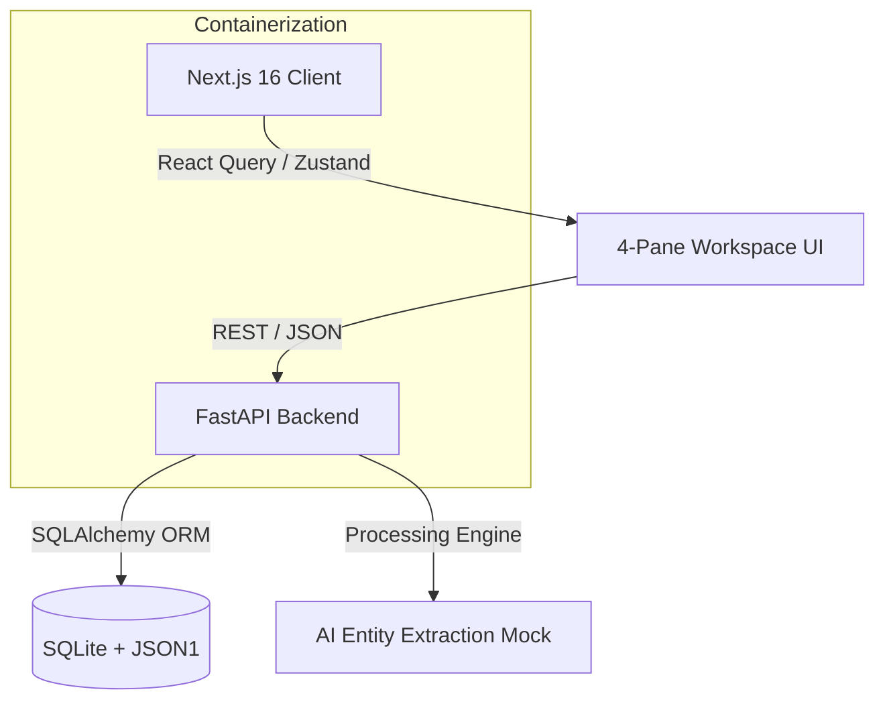

# 🧠 Recall AI
**The Enterprise Organizational Memory Platform**


Most AI meeting tools just transcribe audio. **Recall AI** builds a searchable, cross-meeting knowledge graph. It connects decisions, risks, and action items across your entire organization, turning isolated syncs into a unified, proactive intelligence platform.

> **Live Demo:** [https://recall-ai-dusky.vercel.app](https://recall-ai-dusky.vercel.app)
> **API Endpoint:** [https://recall-ai-9vki.onrender.com/docs](https://recall-ai-9vki.onrender.com/docs)

---

## 🧠 The Architectural Vision

This platform was engineered to solve the "Knowledge Silo" problem in engineering teams. Instead of relying on isolated transcripts, Recall AI utilizes a deterministic backend engine to extract **Entities** (Topics, Decisions, Technologies) and maps them globally.

**Key Engineering Decisions:**
* **Zero N+1 Query Architecture:** Utilized SQLAlchemy `selectinload` to fetch heavily nested meeting intelligence, transcripts, and action items in a single network trip.
* **SQLite JSON1 Extension:** Avoided massive relational junction-table bloat by natively storing highly nested AI analytics arrays (Speaker Stats, Health Breakdowns) directly into JSON columns, maintaining millisecond read speeds.
* **Decoupled State Management:** Abandoned cascading React Contexts in favor of a dual-engine approach: **TanStack Query** for server-state caching and **Zustand** for high-frequency, bidirectional media-to-transcript UI syncing.

---

## ⚡ Core Features

### 1. The 4-Pane Interactive Workspace
* **Bidirectional Sync:** Clicking any transcript block instantly seeks the media player to that exact millisecond. As media plays, the transcript auto-scrolls and highlights active speakers using a precision `useRef` architecture.
* **Transcript Heatmap:** A visual timeline displaying discussion density and argument spikes, allowing executives to jump straight to critical friction points.
* **Style Decoupling:** Achieved a premium, dark-mode glassmorphism aesthetic (Tailwind v4) entirely decoupled from the underlying React state logic.

### 2. Organizational Knowledge Graph
* **Cross-Meeting Intelligence:** Search for a technology (e.g., "Redis") and see a timeline of every meeting, decision, and risk associated with it across the entire workspace.
* **Decision Lifecycle Tracking:** Decisions aren't static. Track a decision from *Proposed* → *Assigned* → *Completed* across multiple different engineering syncs.

### 3. Proactive AI Copilot
* **Grounded Citations:** When asking the Copilot a question, it doesn't just answer; it returns the exact `[Segment ID]` timestamp as a clickable UI citation to prove its accuracy.
* **Workflow Generator:** Instantly compile meeting intelligence into copy-pasteable Slack updates, Stakeholder Emails, or Jira ticket formats.

---

## 🏗️ System Architecture



---

## ✨ The 25-Feature Matrix

| Area | Feature | Status |
| :--- | :--- | :---: |
| **Core** | Multi-tenant Meeting Workspaces | ✅ |
| **Core** | Real-time Transcript Processing | ✅ |
| **Core** | Multi-speaker diarization UI | ✅ |
| **Core** | AI Summary Generation | ✅ |
| **Core** | Sentiment Analysis (Positive, Neutral, Negative) | ✅ |
| **Intelligence** | Automated Action Item Extraction | ✅ |
| **Intelligence** | Risk & Blocker Flagging | ✅ |
| **Intelligence** | Thematic Topic Tagging | ✅ |
| **Intelligence** | Health Score Calculation | ✅ |
| **Intelligence** | Decision Log Extraction | ✅ |
| **Knowledge Graph** | Global Knowledge Entity Normalization | ✅ |
| **Knowledge Graph** | Cross-Meeting Entity Timeline | ✅ |
| **Knowledge Graph** | Omni-Search Bar (Fuzzy matching) | ✅ |
| **Knowledge Graph** | Entity "Mentioned In" Linking | ✅ |
| **Knowledge Graph** | Decision Lifecycle Tracking | ✅ |
| **Analytics** | Individual Team Member Profiles | ✅ |
| **Analytics** | Global Tasks Completed Percentage | ✅ |
| **Analytics** | Average Talk Time Metrics | ✅ |
| **Analytics** | Open Decisions Tracking | ✅ |
| **Analytics** | Meeting Comparison Engine (Mathematical Deltas) | ✅ |
| **Proactive AI** | AI Workflow Generator (Slack, Email, Jira exports) | ✅ |
| **Proactive AI** | Floating Proactive Alerts Toast | ✅ |
| **Proactive AI** | Smart "Next Steps" Recommendations | ✅ |
| **UI/UX** | Dark Mode Glassmorphism Theme | ✅ |
| **UI/UX** | Fluid Framer Motion Micro-animations | ✅ |

---

## 🚀 Deployment

### Live Deployment
| Service | Platform | URL |
| :--- | :--- | :--- |
| Frontend | Vercel | [recall-ai-dusky.vercel.app](https://recall-ai-dusky.vercel.app) |
| Backend | Render | [recall-ai-9vki.onrender.com](https://recall-ai-9vki.onrender.com) |

### Local Development (Docker)
From the root directory:
```bash
docker-compose up -d --build
```

- **Frontend:** http://localhost:3000
- **Backend API:** http://localhost:8000
- **API Docs (Swagger):** http://localhost:8000/docs

### Manual Local Setup
```bash
# Backend
cd backend
pip install -r requirements.txt
uvicorn main:app --reload

# Frontend
cd frontend
npm install
npm run dev
```

---

## 🔮 Future Roadmap & Scaling Strategy

As Recall AI scales to support millions of meetings, the following architectural upgrades are recommended:

1. **Vector Database Integration:** Replace fuzzy SQL `LIKE` queries with a dedicated Vector DB (Pinecone, Qdrant) for true semantic search across meeting transcripts.
2. **Asynchronous Task Queues:** Implement Celery & Redis to offload heavy LLM transcription and entity extraction tasks from the main FastAPI thread.
3. **Redis Caching Layer:** Cache frequent queries (like `/api/v1/analytics/team`) using Redis to reduce database strain on the `TranscriptSegment` tables.
4. **PostgreSQL Migration:** Transition from SQLite to PostgreSQL for concurrent writes and robust JSONB indexing.
