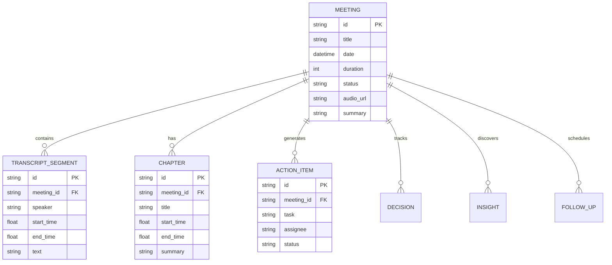

# Database Architecture: FireNotes AI

## Overview

The database is designed with strict **Third Normal Form (3NF)** principles. We have separated core entities (Meetings), heavy text data (Transcripts), AI-generated intelligence (Chapters, Action Items), and User Productivity data (Bookmarks, Comments) into highly normalized tables.

This ensures that querying a list of meetings for the Dashboard does not accidentally load megabytes of transcript data into RAM.

## Entity Relationship Diagram

*(Note: Additional entities like `Comment`, `Bookmark`, `Decision`, `Insight`, and `FollowUp` follow the exact same FK pattern pointing back to `meeting_id`)*

## Tables Explained

### 1. `meetings`
The core aggregate root. Stores high-level metadata (Title, Date, Duration). 
- **Indexes**: Indexed on `date` for fast chronological sorting on the dashboard.

### 2. `transcript_segments`
Stores granular, sentence-level dialogue. 
- **Why granular?** By storing segments individually rather than as a massive single string, we can implement instant precise-timestamp seeking in the UI and allow users to attach comments to specific `segment_id`s.

### 3. Intelligence Tables (`chapters`, `action_items`, `decisions`)
Storing these separately allows us to query across *all* meetings simultaneously. For example, finding all "Pending" action items assigned to "John" across 50 different meetings is a simple `SELECT` query.

### 4. Productivity Tables (`comments`, `bookmarks`)
These represent user engagement on top of the transcript. They feature polymorphic potential (`entity_id`, `action_type`) to allow bookmarking a specific transcript line OR an entire meeting.

## Why SQLite? Future PostgreSQL Migration
SQLite was chosen for the assignment to ensure zero-friction setup for evaluators (no separate database server required). 
However, the codebase uses **SQLAlchemy ORM**. Migrating to PostgreSQL for production merely requires changing the `DATABASE_URL` environment variable and utilizing a Postgres driver (`psycopg2`). The Repository layer entirely abstracts the underlying SQL dialect.
