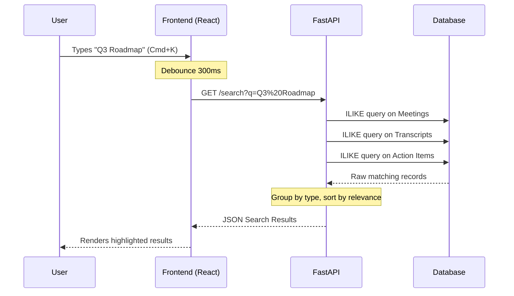
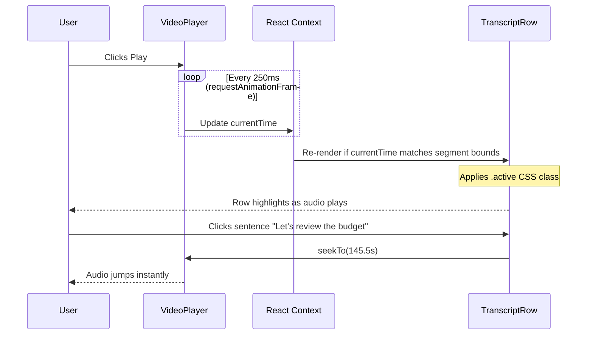
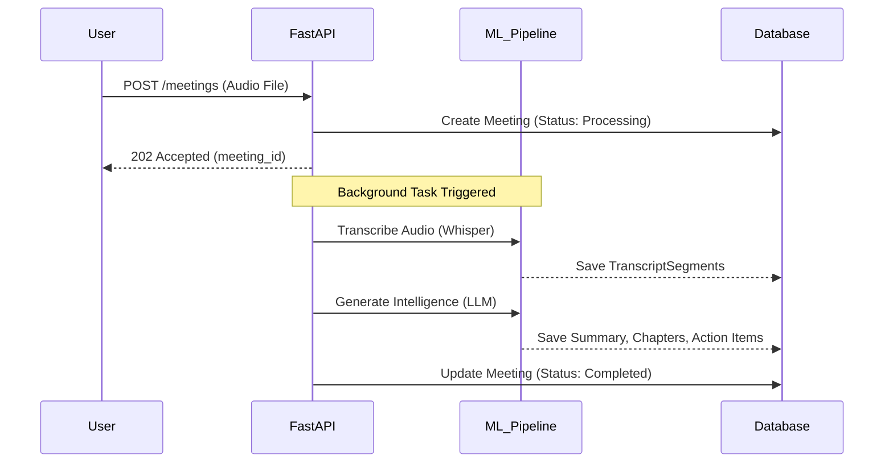

# Sequence Diagrams

## 1. Global Search Workflow

```mermaid
sequenceDiagram
    participant User
    participant Frontend (React)
    participant FastAPI
    participant Database

    User->>Frontend (React): Types "Q3 Roadmap" (Cmd+K)
    Note over Frontend (React): Debounce 300ms
    Frontend (React)->>FastAPI: GET /search?q=Q3%20Roadmap
    FastAPI->>Database: ILIKE query on Meetings
    FastAPI->>Database: ILIKE query on Transcripts
    FastAPI->>Database: ILIKE query on Action Items
    Database-->>FastAPI: Raw matching records
    Note over FastAPI: Group by type, sort by relevance
    FastAPI-->>Frontend (React): JSON Search Results
    Frontend (React)-->>User: Renders highlighted results
```

## 2. Transcript Synchronization

```mermaid
sequenceDiagram
    participant User
    participant VideoPlayer
    participant React Context
    participant TranscriptRow

    User->>VideoPlayer: Clicks Play
    loop Every 250ms (requestAnimationFrame)
        VideoPlayer->>React Context: Update currentTime
    end
    React Context->>TranscriptRow: Re-render if currentTime matches segment bounds
    Note over TranscriptRow: Applies .active CSS class
    TranscriptRow-->>User: Row highlights as audio plays
    
    User->>TranscriptRow: Clicks sentence "Let's review the budget"
    TranscriptRow->>VideoPlayer: seekTo(145.5s)
    VideoPlayer-->>User: Audio jumps instantly
```

## 3. Meeting Upload & AI Generation

```mermaid
sequenceDiagram
    participant User
    participant FastAPI
    participant ML_Pipeline
    participant Database

    User->>FastAPI: POST /meetings (Audio File)
    FastAPI->>Database: Create Meeting (Status: Processing)
    FastAPI-->>User: 202 Accepted (meeting_id)
    
    Note over FastAPI, ML_Pipeline: Background Task Triggered
    FastAPI->>ML_Pipeline: Transcribe Audio (Whisper)
    ML_Pipeline-->>Database: Save TranscriptSegments
    
    FastAPI->>ML_Pipeline: Generate Intelligence (LLM)
    ML_Pipeline-->>Database: Save Summary, Chapters, Action Items
    
    FastAPI->>Database: Update Meeting (Status: Completed)
```
